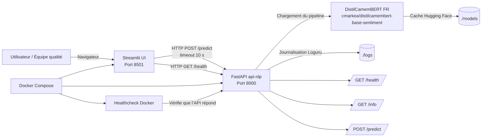

# M0-B2 — Analyse de sentiment FR pour Aubergine Hôtels

## Présentation

Ce projet a été réalisé dans le cadre du parcours IA DEV-ID de Simplon.

L’objectif est de rendre exploitable un modèle NLP français pré-entraîné afin de qualifier automatiquement les avis clients d’Aubergine Hôtels.

Le modèle utilisé est `cmarkea/distilcamembert-base-sentiment`. Il produit initialement une classification en cinq étoiles. Cette sortie est adaptée en trois classes métier :

* négatif ;
* neutre ;
* positif.

## Objectifs

* Déployer un modèle NLP français avec Docker Compose.
* Exposer le modèle avec une API REST FastAPI.
* Adapter une sortie cinq étoiles en trois classes métier.
* Consommer l’API depuis une interface Streamlit.
* Conserver les probabilités brutes du modèle pour la traçabilité.
* Gérer les erreurs réseau, les timeouts et les entrées invalides.
* Journaliser les prédictions et leur latence.
* Tester le fonctionnement de l’API avec pytest.

## Technologies utilisées

* Python 3.11
* FastAPI
* Streamlit
* Hugging Face Transformers
* DistilCamemBERT
* Docker
* Docker Compose
* Pydantic
* HTTPX
* Loguru
* Pytest

## Installation

Créer le fichier `.env` :

```bash
cp .env.example .env
```

Construire et démarrer les services :

```bash
docker compose up --build -d
```

Vérifier leur état :

```bash
docker compose ps
```

## Accès aux services

* Interface Streamlit : `http://localhost:8501`
* Documentation Swagger : `http://localhost:8000/docs`
* Healthcheck : `http://localhost:8000/health`
* Informations du service : `http://localhost:8000/info`

## Tests

Les tests peuvent être exécutés directement dans le conteneur FastAPI :

```bash
docker compose exec api-nlp pytest -v
```
````markdown id="4ksrgm"
## Architecture


```
